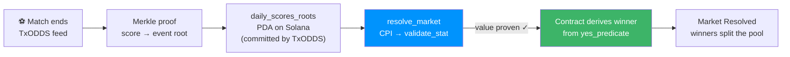

<div align="center">

# ⚽ Onside

### Trustless prediction markets for the World Cup — settled by cryptographic proof, not by an admin.

**Parimutuel binary markets on Solana, resolved on-chain against [TxODDS Tx LINE](https://txline-docs.txodds.com/documentation/quickstart) Merkle-rooted match results. No oracle committee. No settlement multisig. The smart contract proves the result itself.**

[](https://explorer.solana.com/address/6F6fVu5x4ng1mxxLtXseVEE9ZxRAvyjxqeXfDQUsEpvb?cluster=devnet)
[](https://www.anchor-lang.com/)
[](https://nextjs.org/)
[](https://txline-docs.txodds.com/documentation/quickstart)

_Built for the TxODDS World Cup Hackathon — Track 1: Prediction Markets & Settlement._

</div>

---

## The one thing that matters

Every prediction market has the same weak point: **who decides the outcome?** Usually a centralized resolver, an oracle committee, or a multisig — a party you have to trust not to lie.

Onside removes that party. When a match ends, the contract settles by **cryptographically verifying the score against TxODDS's on-chain Merkle root** — the same root TxODDS commits to Solana for every scores update. The settler proves a value; it cannot _choose_ an outcome.

> **Don't trust us — [verify it](https://explorer.solana.com/address/6F6fVu5x4ng1mxxLtXseVEE9ZxRAvyjxqeXfDQUsEpvb?cluster=devnet).** Every settled market links to the exact on-chain transaction that proved it. There's a public **Proofs** page in the app that lists them all, each with a live _"Verify yourself"_ button.

---

## How trustless settlement works

`resolve_market` performs a **CPI into the TxODDS oracle's `validate_stat`**, which aborts unless the claimed stat value (e.g. _home goals = 3_) is a genuine leaf under the day's on-chain `daily_scores_roots` Merkle root. Once the value is _proven_, the contract **derives the winner in-program** from the market's `yes_predicate`. The settler supplies a proof, never a result — a tampered value fails verification, and a correct value can only resolve one way.



- **Permissionless & free** — `validate_stat` takes no signer and no fee; anyone can settle. A keeper does it automatically, so users never click "settle" and the app auto-claims winnings.
- **Auditable** — the proven stat values, the event root, the on-chain daily root, and the settlement tx are all shown in the app's resolution receipt.

---

## Why parimutuel, not peer-to-peer

TxODDS already ships a verified on-chain P2P binary-options primitive — but P2P needs a counterparty for _every_ bet, which is illiquid and trader-only. Onside adds the missing layer: **shared parimutuel pools**. Everyone taps into one YES/NO pool — always liquid, no counterparty, one tap — settled against the _same_ verified on-chain truth. It makes TxODDS's data usable by **fans**, not just trading desks, while making their on-chain settlement product the hero.

---

## What's in the app

|                              |                                                                                                                        |
| ---------------------------- | ---------------------------------------------------------------------------------------------------------------------- |
| ⚡ **One-tap betting**       | Guest wallet (in-browser, no install) or connect Phantom / Solflare. Native-SOL parimutuel stakes.                     |
| 📊 **Live consensus odds**   | Real TxODDS de-margined implied probabilities per market, charted over time (the odds _move_).                         |
| 🔴 **Live match feed**       | Server-side SSE proxy streams scores + odds; markets react in real time.                                               |
| 🎯 **Prop / exotic markets** | Not just Over/Under & 1X2 — corners, cards, "a red card shown", "team to score". The engine settles _any_ TxODDS stat. |
| 🛡️ **Proofs page**           | Public audit trail of every settled market + its on-chain settlement transaction.                                      |
| 📈 **Analytics & My Bets**   | Total liquidity, open/settled counts, and your positions & P&L across all matches.                                     |
| 💧 **Seeded liquidity**      | Pools pre-seeded at consensus ratios so small bets pay realistic multiples.                                            |
| 🎟️ **Same-match parlays**    | Combine 2–8 YES/NO picks into one fixed-payout ticket backed by the protocol parlay vault.                             |

---

## Architecture

```
onside/
├── programs/onside/        # Anchor program (Rust) — the market + settlement engine
│   └── src/lib.rs          #   initialize_market · place_bet · resolve_market · void_market · claim
├── client/                 # TypeScript operator scripts (run with `npx tsx`)
│   └── src/
│       ├── get-token.ts            # fetch the free TxODDS Tx LINE API token
│       ├── create-markets.ts       # seed markets for a fixture (goals + props)
│       ├── keeper.ts               # auto-settles closed markets from live proofs (permissionless)
│       ├── seed-liquidity.ts       # seed both pool sides at consensus ratios
│       ├── dump-settlement-sigs.ts # snapshot settle-tx sigs for the Proofs page
│       └── settle-fixture.ts       # settle one fixture on demand
├── web/                    # Next.js 14 dApp (App Router, Tailwind, wallet-adapter)
│   ├── app/                #   lobby · /fixture/[id] · /proofs · /stats · /portfolio · /api/*
│   ├── components/         #   TradePanel · ProofReceipt · OddsChart · MatchBroadcast · …
│   └── lib/                #   onside.ts (program client) · odds.ts · markets.ts · wallet.tsx
├── tests/                  # Anchor / LiteSVM tests
└── Anchor.toml
```

**The Anchor program** (`6F6fVu5x4ng1mxxLtXseVEE9ZxRAvyjxqeXfDQUsEpvb`)

- `Market { authority, fixture_id, stat_a_key, stat_b_key, op, yes_predicate, close_ts, total_yes, total_no, outcome, status, fee_bps, … }`
- `Position { market, owner, yes_amount, no_amount }` — one per (market, wallet)
- Parimutuel payout = `stake × pool / winning_pool`, fee taken on profit; void / no-winner ⇒ full refund. Stakes are held as lamports in the market PDA.

---

## Getting started

### Prerequisites

- Rust + [Solana CLI](https://docs.solanalabs.com/cli/install) + [Anchor 0.32](https://www.anchor-lang.com/docs/installation)
- Node.js 18+
- A Solana devnet keypair at `~/.config/solana/id.json` with a little devnet SOL (this is the treasury/authority that creates markets and funds the guest faucet)

### 1 — Program (already deployed to devnet; only needed to redeploy)

```bash
anchor build
anchor deploy --provider.cluster devnet
```

### 2 — TxODDS data token (free, self-serve)

```bash
cd client
npm install
npx tsx src/get-token.ts        # caches the token to client/.txline-token.json
```

### 3 — Web app

```bash
cd web
npm install
cp .env.example .env.local      # then set NEXT_PUBLIC_RPC (a devnet RPC URL)
npm run dev                      # http://localhost:3000
```

Open the app, click **Connect → Continue as guest**, hit **Add funds**, and bet. Markets settle themselves via the keeper.

### 4 — (optional) seed & operate markets

```bash
cd client
# create markets for a fixture (goals + prop markets)
ANCHOR_PROVIDER_URL=https://api.devnet.solana.com FIXTURE_ID=<id> PROPS=1 npx tsx src/create-markets.ts
# run the auto-settlement keeper
ANCHOR_PROVIDER_URL=https://api.devnet.solana.com npx tsx src/keeper.ts
# seed liquidity at consensus ratios (dry-run by default; EXECUTE=1 to actually send)
ANCHOR_PROVIDER_URL=https://api.devnet.solana.com POOL_SOL=0.23 npx tsx src/seed-liquidity.ts
```

Initialize and fund the parlay vault after deploying the updated program:

```bash
cd client
ACTION=init npx tsx src/parlay-vault.ts
ACTION=deposit AMOUNT_SOL=5 npx tsx src/parlay-vault.ts
# Admin-controlled withdrawal:
ACTION=withdraw AMOUNT_SOL=1 npx tsx src/parlay-vault.ts
```

> Client scripts use **`npx tsx`** (not `ts-node`, which trips `ERR_REQUIRE_ESM` on some deps).

---

## Environment & secrets — where things live

**No secret is committed to this repo.** All of the following are git-ignored:

| What                                 | Location                            | Notes                                                                                                                          |
| ------------------------------------ | ----------------------------------- | ------------------------------------------------------------------------------------------------------------------------------ |
| **Treasury / authority private key** | `~/.config/solana/id.json`          | Outside the repo. Creates markets, runs the keeper, backs the faucet. In production, pass it as `TREASURY_SECRET_KEY` instead. |
| **TxODDS API token**                 | `client/.txline-token.json`         | Generated by `get-token.ts`. The web app reads it server-side (or via `TXLINE_JWT` / `TXLINE_API_TOKEN`).                      |
| **Liquidity seed wallet**            | `client/.seed-wallet-b.json`        | Auto-created by `seed-liquidity.ts` to seed the NO side of pools. Holds devnet SOL (recoverable).                              |
| **Program upgrade keypair**          | `target/deploy/onside-keypair.json` | Standard Anchor build artifact.                                                                                                |
| **Web app config**                   | `web/.env.local`                    | Public `NEXT_PUBLIC_*` values + optional server secrets. See [`web/.env.example`](web/.env.example).                           |

Web environment variables (see [`web/.env.example`](web/.env.example)):

| Variable                          | Required | Purpose                                                                              |
| --------------------------------- | -------- | ------------------------------------------------------------------------------------ |
| `NEXT_PUBLIC_RPC`                 | ✅       | Solana **devnet** RPC URL (a keyed Helius/OnFinality URL avoids public rate limits). |
| `NEXT_PUBLIC_DEMO_STREAM_URL`     | —        | Fallback match-video URL for the live player.                                        |
| `TREASURY_SECRET_KEY`             | —        | JSON secret-key array for the faucet; falls back to `~/.config/solana/id.json`.      |
| `TXLINE_JWT` / `TXLINE_API_TOKEN` | —        | TxODDS creds; falls back to `client/.txline-token.json`.                             |

> ⚠️ **Never commit** `.env.local`, `*-keypair.json`, `.seed-wallet-*.json`, or `.txline-token.json`. The `.gitignore` files already block them — keep it that way.

---

## On-chain addresses (devnet)

|                              | Address                                                                                                                                           |
| ---------------------------- | ------------------------------------------------------------------------------------------------------------------------------------------------- |
| **Onside program**           | [`6F6fVu5x4ng1mxxLtXseVEE9ZxRAvyjxqeXfDQUsEpvb`](https://explorer.solana.com/address/6F6fVu5x4ng1mxxLtXseVEE9ZxRAvyjxqeXfDQUsEpvb?cluster=devnet) |
| **TxODDS oracle (txoracle)** | [`6pW64gN1s2uqjHkn1unFeEjAwJkPGHoppGvS715wyP2J`](https://explorer.solana.com/address/6pW64gN1s2uqjHkn1unFeEjAwJkPGHoppGvS715wyP2J?cluster=devnet) |

## TxODDS Tx LINE endpoints used

- `GET /api/fixtures/snapshot` — World Cup fixtures
- `GET /api/scores/snapshot/{fixtureId}` + `GET /api/scores/stream` (SSE) — live scores
- `GET /api/odds/snapshot/{fixtureId}?asOf=` — consensus odds (1X2 / Over-Under), with history
- `GET /api/scores/stat-validation` — the **Merkle proof** consumed by `resolve_market`
- On-chain `daily_scores_roots` PDA — the root the contract verifies against

---

## Tech stack

**Program:** Rust · Anchor 0.32 · CPI into the TxODDS oracle
**Client:** TypeScript · `@coral-xyz/anchor` · `@solana/web3.js` · `tsx`
**Web:** Next.js 14 (App Router) · React 18 · Tailwind · `@solana/wallet-adapter` · lucide-react · sonner · dependency-free SVG charts

---

## Security & honest limitations

- **Devnet only.** Test SOL, never real money. The faucet is hard-gated off mainnet with per-address and global caps.
- **In-play settlement.** Markets settle against the latest _proven_ value from the feed; the value is always cryptographically verified, but the timing reflects the current feed state (devnet fixtures are replays).
- **Public RPC.** The app rotates across multiple public devnet RPCs with failover; a dedicated keyed RPC is recommended for a heavy demo.
- **Guest wallet** is an in-browser devnet convenience wallet for instant testing — not a custody solution.

---

<div align="center">

**Powered by [TxODDS Tx LINE](https://txline-docs.txodds.com/documentation/quickstart) · Built on [Solana](https://solana.com)**

_The result is proven, not trusted._

</div>
